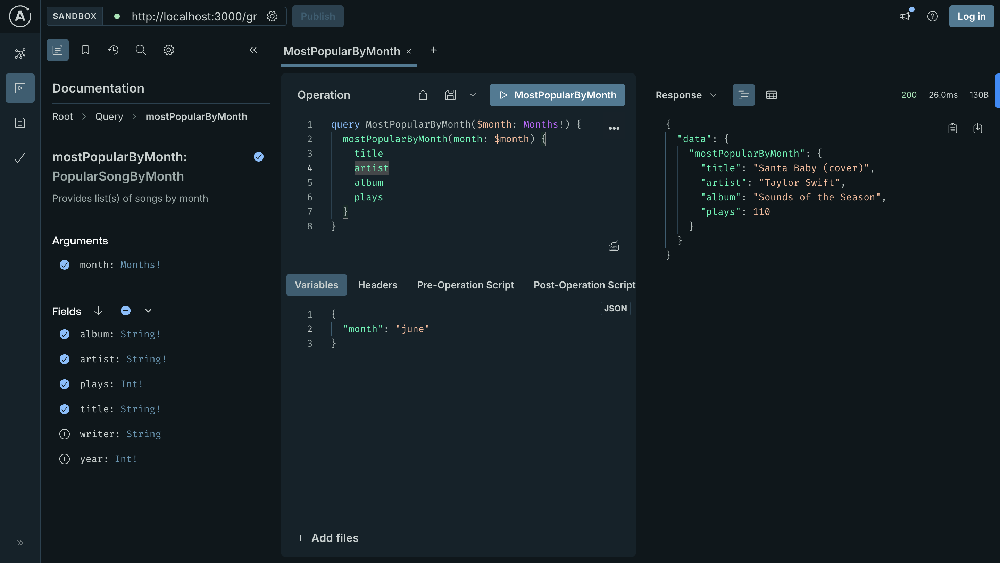

# Swiftcloud

Get song details of Taylor Swift

---



---

### Setup

```
git clone git@github.com:ankkho/swiftcloud.git
```
```
cd swiftcloud && npm install 
```
```
npm run start:dev
```

Visit [localhost:3000/graphql](http://localhost:3000/graphql)

---

#### Run tests
```
npm run test
```

> [Husky](https://typicode.github.io/husky/) `pre-commit` hook would format, lint and run tests, before every commit.

> [Commitlint](https://commitlint.js.org/) is being used in order to maintain commit convention.

---

### Docker

#### In order to run swiftcloud as docker container, run the following commands:

```
docker build -t swiftcloud .
```
```
docker run -p 3000:3000 swiftcloud
```

Visit [localhost:3000/graphql](http://localhost:3000/graphql)

---

